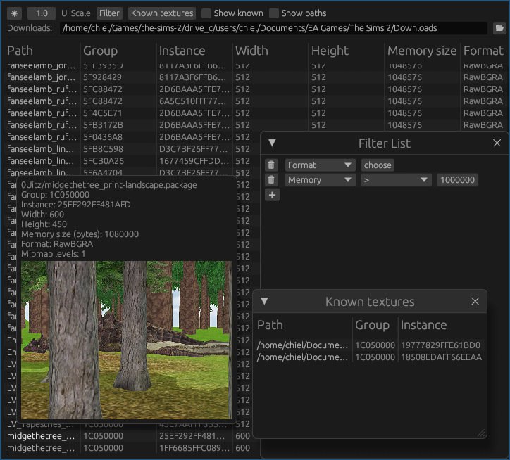
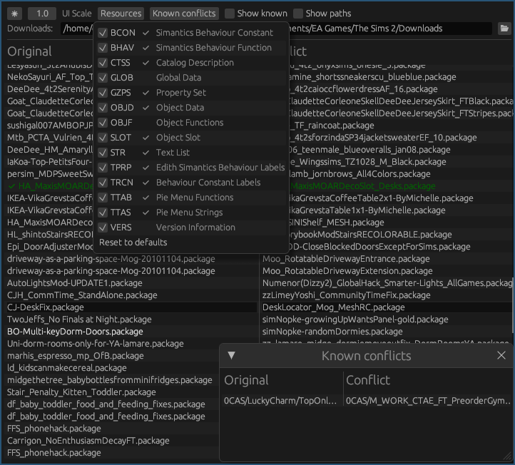
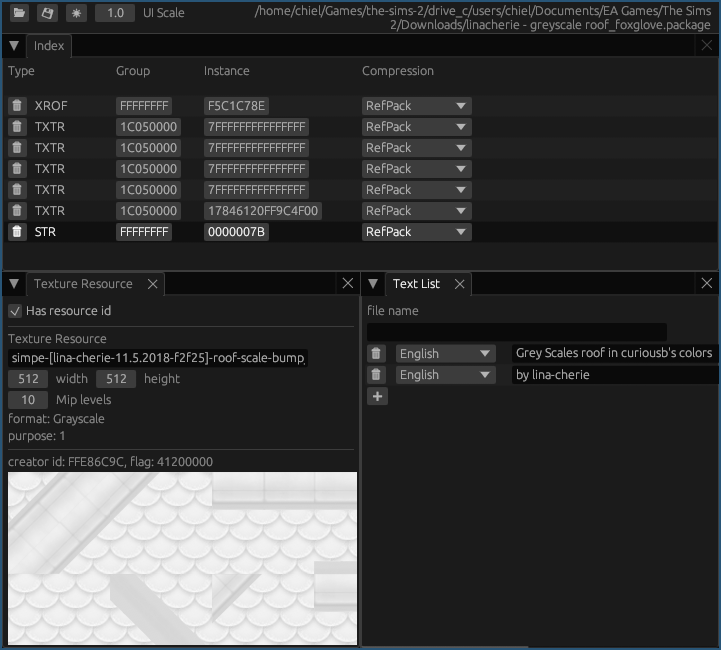

# DBPF Utilities

This repository contains a rust library and utilities to work with Maxis' DBPF packages.

These tools will work for any package from a game that uses the DBPF format[^1] but the contained resources which are currently best supported are those used in The Sims 2.

> [!CAUTION]
> These tools are currently EXPERIMENTAL!
> Prepare for any packages you edit with them to be potentially broken.
> Make proper backups accordingly.

##  Batl: Big Awful Texture Locator
Search for textures in packages which use a non-optimal format or which are too big for your liking.  
Since the Sims 2 and other games are 32-bit programs, they are limited to 4GiB of memory. Large textures will fill up this memory more quickly, leading to problems such as the infamous pink flashing. Batl will help you find these textures to (possibly
automatically in the future) convert these textures to a more suitable format or size.

##  Yact: Yet Another Conflict Tool
A native Linux version of HCDU Plus. If HCDU Plus works for you then there should be no reason to use this tool, but you might want to use it in case you prefer the interface.

##  Yape: Yet Another Package Editor
A native Linux version of SimPE. Currently several editors are implemented for various resource types, and the intention is to add editors for resources for which SimPE does not have a convenient editor.

### Editors currently implemented:

| Abbreviation | Name                | Reading            | Editing            |
|--------------|---------------------|--------------------|--------------------|
| GZPS         | Property Set        | :white_check_mark: | :white_check_mark: |
| BINX         | Binary Index        | :white_check_mark: | :white_check_mark: |
| SKIN         | Sim Outfits         | :white_check_mark: | :white_check_mark: |
| TXTR         | Texture Resource    | :white_check_mark: | :interrobang:      |
| TXMT         | Material Definition | :white_check_mark: | :white_check_mark: |
| STR          | Text List           | :white_check_mark: | :white_check_mark: |
| CTSS         | Catalog Description | :white_check_mark: | :white_check_mark: |
| TTAs         | Pie Menu Strings    | :white_check_mark: | :white_check_mark: |

### Generic editor for:

> Track Settings,
> Floor XML,
> Neighbourhood Object XML,
> Wants XML,
> Mesh Overlay XML,
> Face Modifier XML,
> Texture Overlay XML,
> Fence XML,
> Skintone XML,
> Material Override,
> Collection,
> Face Neutral XML,
> Hairtone XML,
> Face Region XML,
> Face Archetype XML,
> Sim Data XML,
> Roof XML,
> Pet Body Options,
> Wall XML,
> Sim DNA,
> Version Information,
> Sim Outfits,

And a hexadecimal editor for all other types

[^1]: These include The Sims 2, The Sims 3, The Sims 4, The Sims Stories, The Sims Online, Simcity 4, Simcity 2013, Spore, [Tetris](https://en.wikipedia.org/wiki/Tetris_(Electronic_Arts))[^2], [Tetris Blitz](https://en.wikipedia.org/wiki/Tetris_Blitz)[^2], [MySims](https://en.wikipedia.org/wiki/MySims)[^3], and possibly others.
[^2]: [https://www.zenhax.com/viewtopic.php@t=15001.html]()
[^3]: [https://github.com/owlks4/DBPF-package-manager]()
